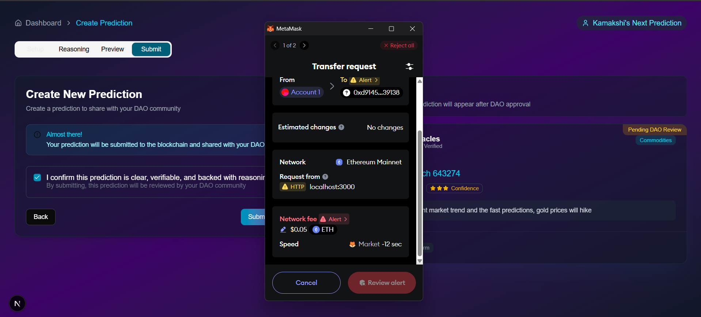

# 🔮 Investra: Web3 + AI Financial Forecasting Platform

## ❓ Problem Statement

In the world of finance, there's a growing distrust in self-proclaimed “finfluencers” spreading misleading or unaudited investment advice on social media. Most platforms lack transparency, verification, or accountability for these predictions — leading to misinformation and financial losses.

> 🔧 **We aim to solve this by:**
- ✅ Creating a **fully decentralized platform** where verified communities govern predictions, not corporations or individual influencers.A platform where predictions are verified and approved by **communities (DAOs)**.
- ✅ Using **AI** to explain and validate reasoning behind investment ideas.
- ✅ Ensuring **transparency, credibility, and decentralization** in financial forecasting.

- Deployed link: https://hack-india25-maverick1.vercel.app/
---

## 🚀 Tech Stack

- **Frontend:** Next.js (JavaScript), Tailwind CSS  
- **Backend:** Node.js, Express.js
- **Database:** MongoDB Atlas
- **Web3:** MetaMask, Ethers.js , Solidity 
- **Authentication:** MetaMask (Wallet-based auth)  
- **AI Integration:** OpenAI GPT-3.5/4 (Reasoning engine for financial predictions)  

---

## 🧩 Site Flow

### 1. `Wallet Connect`
- User connects using MetaMask.
- Wallet address is fetched for session identity.

### 2. `Role Selection`
- After login, users choose:
  - 🎯 **Influencer** – Can submit predictions (via communities only)
  - 📘 **Learner** – Can follow communities, view predictions

### 3. `Dashboard (Shared Access)`
- Everyone can see approved predictions.
- Each prediction has: reasoning, confidence score, category, upvotes.

### 4. `Communities Page (Influencer Access Only)`
- Influencers can create or join DAOs.
- View prediction suggestions in pending state.
- Approve/reject predictions via on-chain call (mocked in demo).

### 5. `Create Prediction (Influencers Only)`
- Multistep form:
  1. Setup (Title, Category, Community)
  2. Reasoning (with GPT)
  3. Preview
  4. **Submit to blockchain** (simulated)
  5. If DOAs approves it, then only it does to the main dashboard
---

## 🧪 Features Completed for Demo

- ✅ Wallet connection
- ✅ Role selection with context API
- ✅ Dynamic dashboard with verified predictions
- ✅ Community suggestion and DAO voting (UI working, on-chain mocked)
- ✅ Smart contract coded (not deployed due to ETH funding issue)
- ✅ Backend API with MongoDB integration

---

## 🛠️ How to Run the Project Locally

### Frontend Setup
```bash
git clone https://github.com/your-username/investra.git
cd investra
npm install
npm run dev
```

### Backend Setup
```bash
cd backend
npm install
npm run dev
```

Make sure MetaMask is installed and connected

## ⚠️ Blockchain Status
- Our smart contract is ready and tested locally, but we were unable to deploy it due to:
- ⛓️ Wallet not funded before demo deadline
For the hackathon, we've mocked contract responses in the frontend so the project remains functional and presentable. If we move forward, we will deploy and integrate it fully.

---

## 📸 Demo Screenshot (Preview)


